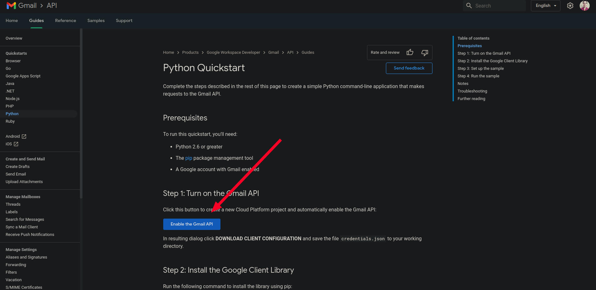
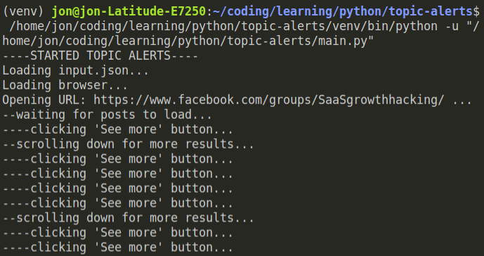

# Facebook Keyword Alerts
A Python script that generates email alerts when specific keywords are mentioned in Facebook group posts. Uses Selenium, Gmail's API and the Firefox browser.

# Table of contents
- [Facebook Keyword Alerts](#facebook-keyword-alerts)
- [Table of contents](#table-of-contents)
- [Requirements](#requirements)
- [How it works](#how-it-works)
- [Limitations](#limitations)
- [Features to consider adding](#features-to-consider-adding)

# Requirements

The script requires a number of items in order to run:

- [Python 3](https://docs.python.org/3/)
- [Firefox browser](https://www.mozilla.org/firefox/new/) installed on your local machine.
- [geckodriver file](https://github.com/mozilla/geckodriver/releases) downloaded in this folder. The file will enable you to run Firefox using Selenium.
- A [Gmail account](https://gmail.com/).
- A `credentials.json` file in this folder, which contains credentials enabling Gmail API on your gmail account. You need to download this file from [here](https://developers.google.com/gmail/api/quickstart/python) by clicking the `Enable the Gmail API` button.
  
  

- An `input.json` file that contains the Facebook group URLs, keywords used for alerts, sender and receiver email addresses.
  
  The file also needs to hold the path to the Firefox profile you wish to use with the browser. You can find it by opening `about:support` in the Firefox browser and looking at the path in the `Profile Directory` row - see [this](https://support.mozilla.org/en-US/kb/profiles-where-firefox-stores-user-data) for more details.

  This is how the json file should be structured:

```json
{
  "alerts": [
    {
      "url": "https://www.facebook.com/groups/SaaSgrowthhacking/",
      "keywords": ["marketing", "sales"]
    },
    {
      "url": "https://www.facebook.com/groups/DeepNetGroup/",
      "keywords": ["pytorch", "nvidia"]
    }
  ],
  "firefox_profile_path": "/home/jon/.mozilla/firefox/yy6ndmx3.default-release",
  "gmail": {
    "sender": "mihail.automated.alerts@gmail.com",
    "receiver": "mihailmarian12@gmail.com"
  }
}
```

# How it works

[Click here](https://youtu.be/_H-7zwYzkgw) for video demo.

Once all the [requirements](#requirements) are fulfilled, you can launch the script from [main.py](./main.py). The script takes 6-10 minutes to complete, which is why I've added several `print` statements indicating the different stages it's going through.



The script starts by loading the data from the `input.json` file and checking whether it's in the correct format. If not, a custom exception called `JsonError` is raised and the script ends gracefully as the exception is wrapped inside a `try/except` statement. 

```python
try:
    print("Loading input.json...")

    with open("input.json", "r") as input_file:
        input_json = json.load(input_file)

    for key in ["alerts", "firefox_profile_path", "gmail"]:
    if key not in input_json:
            raise JsonError(f"'{key}' key not found.")

    # --snip--
except FileNotFoundError:
    print("ERROR - Unable to find 'input.json' file in the current directory.")
except json.decoder.JSONDecodeError:
    print("ERROR - 'input.json' contents aren't JSON.")

print("----FINISHED TOPIC ALERTS----")
```

Assuming the data structure is correct, the script then proceeds to creating an instance of the `Alerts` class. The resulting object is initialized with the `results` key holding all of the relevant data scraped from Facebook. 

I leverage [Selenium's Python bindings](https://pypi.org/project/selenium/) in order to fetch this data. The bindings are placed in the `SeleniumBrowser` custom class. I created this class because 

# Limitations

# Features to consider adding
