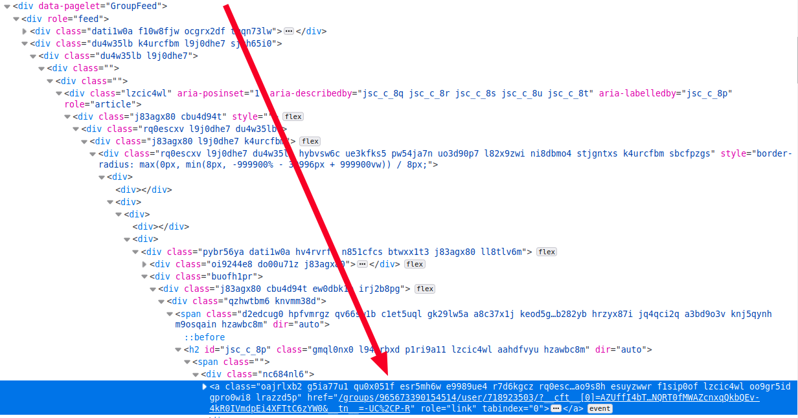
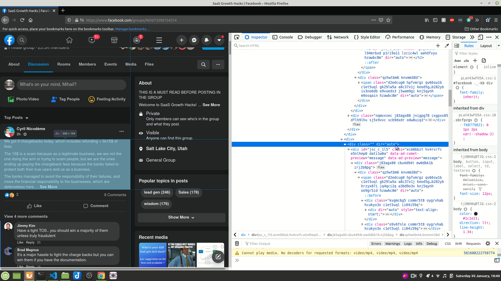

# Facebook Keyword Alerts
A Python script that generates email alerts when specific keywords are mentioned in Facebook group posts. Uses Selenium, Gmail's API and the Firefox browser.

# Table of contents
- [Facebook Keyword Alerts](#facebook-keyword-alerts)
- [Table of contents](#table-of-contents)
- [Requirements](#requirements)
- [How it works](#how-it-works)
  - [Video demo](#video-demo)
  - [Launch](#launch)
  - [Scraping Facebook](#scraping-facebook)
    - [Challenges](#challenges)
      - [Finding reliable CSS selectors](#finding-reliable-css-selectors)
      - [Making content visible to Selenium](#making-content-visible-to-selenium)
  - [Using Gmail for Alerts](#using-gmail-for-alerts)
- [Features to consider adding](#features-to-consider-adding)

# Requirements

The script requires a number of items in order to run:

- [Python 3](https://docs.python.org/3/)
- [Firefox browser](https://www.mozilla.org/firefox/new/) installed on your local machine.
- [geckodriver file](https://github.com/mozilla/geckodriver/releases) downloaded in this folder. The file will enable you to run Firefox using Selenium.
- A [Gmail account](https://gmail.com/) that will be used to send the automated alerts.
- A `credentials.json` file in this folder, which contains credentials enabling Gmail API on your gmail account. You need to download this file from [here](https://developers.google.com/gmail/api/quickstart/python) by clicking the `Enable the Gmail API` button.
  
  

- An `input.json` file that contains the Facebook group URLs, keywords used for alerts, sender and receiver email addresses.
  
  The file also needs to hold the path to the Firefox profile you wish to use with the browser. You can find it by opening `about:support` in the Firefox browser and looking at the path in the `Profile Directory` row - see [this](https://support.mozilla.org/en-US/kb/profiles-where-firefox-stores-user-data) for more details.

  This is how the json file should be structured:

```json
{
  "alerts": [
    {
      "url": "https://www.facebook.com/groups/SaaSgrowthhacking/",
      "keywords": ["marketing", "sales"]
    },
    {
      "url": "https://www.facebook.com/groups/DeepNetGroup/",
      "keywords": ["pytorch", "nvidia"]
    }
  ],
  "firefox_profile_path": "/home/jon/.mozilla/firefox/yy6ndmx3.default-release",
  "gmail": {
    "sender": "mihail.automated.alerts@gmail.com",
    "receiver": "mihailmarian12@gmail.com"
  }
}
```

# How it works

## Video demo

[Click here](https://youtu.be/_H-7zwYzkgw) for a video demonstration.

## Launch

Once all the [requirements](#requirements) are fulfilled, you can launch the script from [main.py](./main.py). The script takes 6-10 minutes to complete, which is why I've added several `print` statements indicating the different stages it's going through.


## Scraping Facebook

The script starts by reading the JSON object from the `input.json` file. The `alerts` and `firefox_profile_path` keys inside this object are then used to create an instance of the `Alerts` class. The resulting object is initialized with the `results` key holding all of the relevant data scraped from Facebook.

I leverage [Selenium's Python bindings](https://pypi.org/project/selenium/) in order to fetch this data. The bindings are placed in the `SeleniumBrowser` custom class, together with additional methods that allow me to parse Facebook's website.

### Challenges

There were two main challenges I faced looking for the right data on Facebook's web pages.

#### Finding reliable CSS selectors

The HTML structure is incredibly complex, with a very large number of layers that have indistiguishable attributes. For example, here's how far I had to go in order to find a reliable selector for the post publisher's name:



I eventually managed to distinguish a pattern:

```html
<!--wrapper for the entire post-->
<div role="article" aria-posinset>
  <h2><a>Publisher Name</a></h2>
  <div dir="auto">Post content</div>
</div>
```

I catch any exceptions when I parse through a post because I still get several incorrect results even with this pattern.

#### Making content visible to Selenium

On page load, Facebook only generates a small number of posts for obvious reasons. I was able to resolve this by asking Selenium to press the `END` key 7 times (arbitrary number) when the page is loaded. 

When loading a lot of posts, you have to be careful because Facebook actually hides elements that are too far away from your viewport. 



This is important because Selenium can't interact with elements that are hidden. In my case, I had to make sure I click all the "See more" links for the posts content **before** I hit the `END` key to load more content

```python
def expand_results(self):
    self.click_see_more_buttons()
    body = self.find_element_by_tag_name("body")
    for _ in range(7):
        print("--scrolling down for more results...")
        body.send_keys("webdriver" + Keys.END)
        time.sleep(10)
        self.click_see_more_buttons()
```

## Using Gmail for Alerts


# Features to consider adding

- Parse site with BeautifulSoup.
- Fetch more posts from a Facebook group.
- replace fixed time wait with wait by post
- only recent content
- 